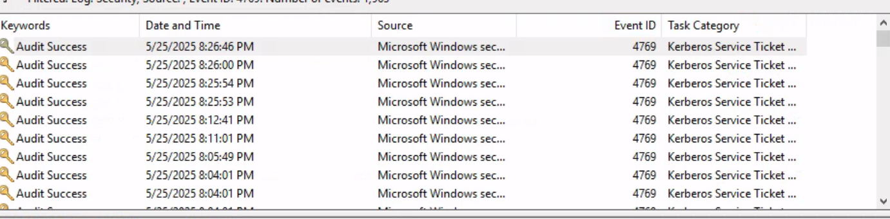

# Keberoasting-
Simulation attack. 

## 🛠 PART-1 Executing Rebeus. 
This command uses Rubeus to request service tickets (TGS) for all accounts with SPNs in the domain, then saves the Kerberos ticket hashes to spn.txt for offline cracking.
 
## 🔗 PART-2 Sharing File. 
I shared the file using smb. 

## 📥PART-3 Downloading file from Kali machine. 

## 🔓 PART-4 Using hashcat
This command uses Hashcat to crack Kerberoast hashes (mode 13100) from spn.txt using the wordlist passwords.txt. Cracked passwords are saved to cracked.txt 🔓

## 💥🔓 PART-5 Password Cracked 
We got the password. 

## 📄🔍 PART-6 
I started reviewing the logs  to look for suspicious activity. While analyzing Event ID 4769, which logs Kerberos service ticket requests, I noticed unusual patterns that could indicate a Kerberoasting attempt. These logs helped me identify accounts that were being targeted.

## 🔐 How to Prevent Kerberoasting:

Kerberoasting is a technique where attackers steal service tickets and try to crack them offline to get service account passwords. Here's how to stay protected:

## 💪 Use strong passwords:
Make sure all service accounts have long, complex passwords. Easy-to-guess = easy target!

## 🎯 Apply least privilege:
Give service accounts only the access they truly need — nothing more.

## 🤖 Use gMSAs (Group Managed Service Accounts):
These manage secure, rotating passwords automatically. Less headache, more security!

## 🔍 Monitor TGS requests:
Keep an eye on unusual ticket requests, especially those using weak RC4 encryption.

## 🚫 Disable RC4 encryption:
Prefer AES encryption instead — it’s much harder to crack!

## 🔄 Rotate passwords regularly:
Change service account passwords often, and avoid reusing them.

Stay one step ahead of attackers! 🛡️
