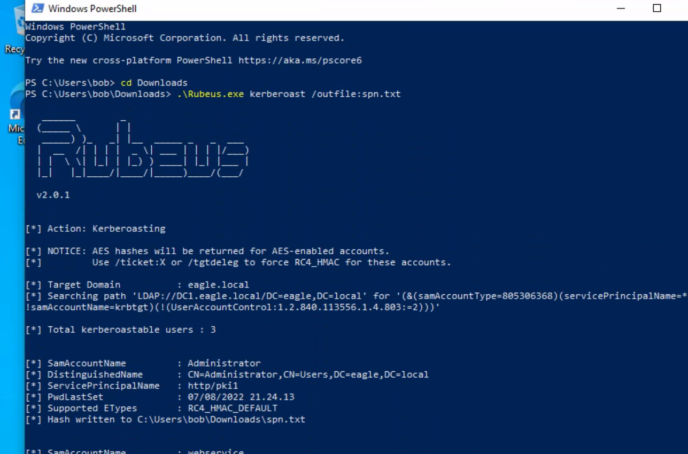
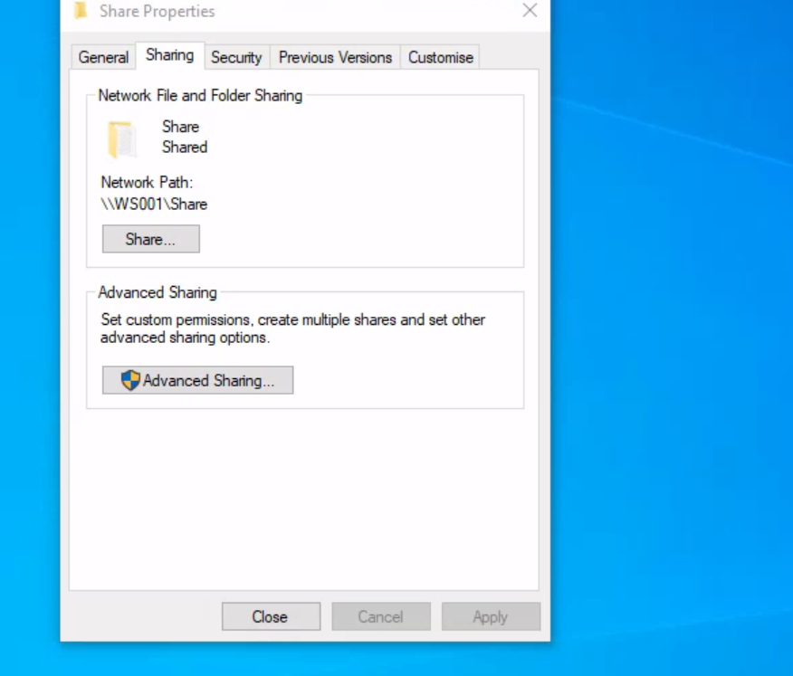
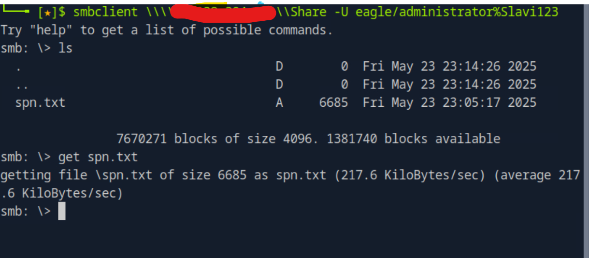

# Keberoasting-
Simulation attack. 

## 🛠 PART1. Executing Rebeus. 
This command uses Rubeus to request service tickets (TGS) for all accounts with SPNs in the domain, then saves the Kerberos ticket hashes to spn.txt for offline cracking.
 
## PART2. Sharing File. 
I shared the file using smb. 

## PART3. Downloading file from Kali machine. 

## 🔓 PART4 Using hashcat
This command uses Hashcat to crack Kerberoast hashes (mode 13100) from spn.txt using the wordlist passwords.txt. Cracked passwords are saved to cracked.txt 🔓

